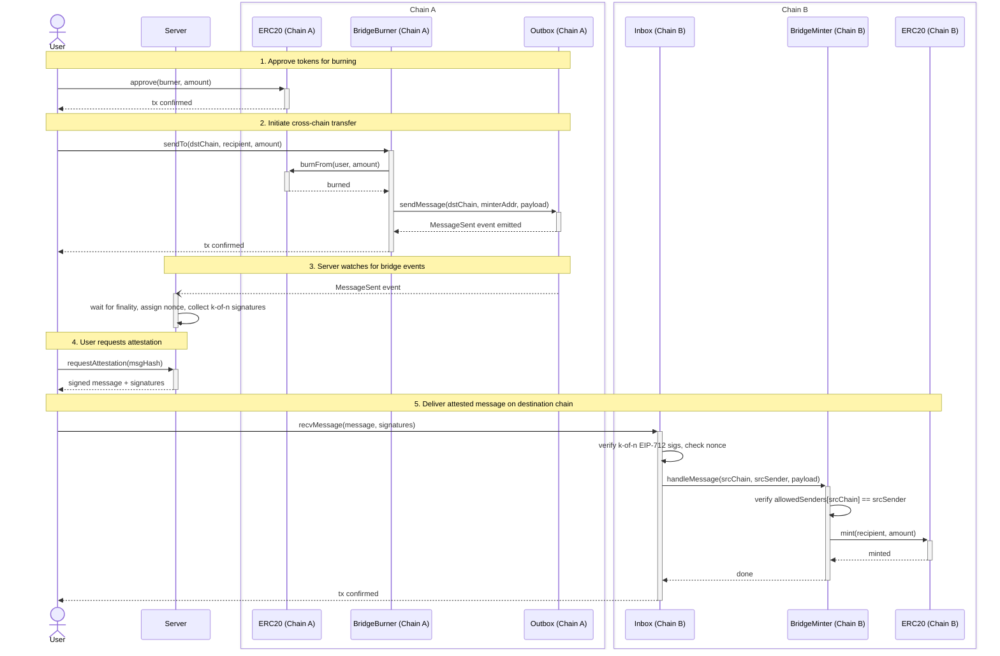

# How the stablecoin bridge works

A burn-and-mint bridge that moves stablecoin tokens between EVM chains. Tokens are burned on the source chain, an off-chain attestation service confirms the burn after finality, and equivalent tokens are minted on the destination chain. The bridge uses a k-of-n attestor threshold with EIP-712 typed signatures for security.

## Contracts

| Contract | Description |
|---|---|
| **Outbox** | Generic message outbox. Accepts messages from senders and emits events for the off-chain attestation service. Stateless. |
| **Inbox** | Generic message inbox. Verifies k-of-n EIP-712 attestor signatures, enforces replay protection via nonces, and delivers payloads to destination contracts. Ownable (attestor set and threshold management). |
| **BridgeBurner** | Application-level bridge entry point. Burns tokens from the user via the stablecoin's `burnFrom`, then sends a message through the Outbox. Ownable (configuration management). |
| **BridgeMinter** | Application-level bridge exit point. Receives messages from the Inbox, verifies the source chain and sender against an allowed senders mapping, then mints tokens to the recipient. Holds MINTER_ROLE on the stablecoin. |
| **TokenMintMessage** | Library for encoding and decoding the application-level payload (recipient + amount). Used by both BridgeBurner and BridgeMinter. |

All contracts are UUPS upgradeable.

## Architecture

### Layering

The bridge is split into two layers:

```
┌─ Application Layer ──────────────────────────────────────────────┐
│  BridgeBurner                              BridgeMinter          │
│  • burns tokens                            • mints tokens        │
│  • encodes payload (TokenMintMessage)      • decodes payload     │
│  • holds BURNER_ROLE                       • holds MINTER_ROLE   │
└──────────┬────────────────────────────────────────▲──────────────┘
           │ sendMessage(dstChain,                  │ handleMessage(srcChain,
           │            dstRecipient,               │               srcSender,
           │            payload)                    │               payload)
┌─ Transport Layer ────────────────────────────────────────────────┐
│  Outbox (IOutbox)                          Inbox (IInbox)        │
│  • emits MessageSent event                 • EIP-712 sig verify  │
│  • stateless                               • k-of-n threshold    │
│                                            • nonce tracking      │
│                                            • attestor management │
└──────────────────────────────────────────────────────────────────┘
```

This separation provides several benefits:

- **Auditability**: each component is simpler and easier to audit in isolation.
- **Swappability**: the transport layer can be replaced (e.g., with a native L1-L2 bridge) without changing the application-level contracts.
- **Least privilege**: no single contract holds both minter and burner roles.
- **Testability**: message encoding/decoding lives in a library (`TokenMintMessage`), so it can be tested independently of the contracts.

### Message structure

The full message has two levels: the transport envelope and the application payload.

**Transport-level message** (constructed by the off-chain server, signed by attestors):

| Field | Type | Description |
|---|---|---|
| `srcChain` | `uint256` | Chain ID where the burn happened |
| `srcSender` | `address` | Address that sent the outbox message (BridgeBurner) |
| `dstChain` | `uint256` | Chain ID where tokens should be minted |
| `dstRecipient` | `address` | Address to call on the destination chain (BridgeMinter) |
| `nonce` | `bytes32` | Replay protection identifier, assigned by the server |
| `payload` | `bytes` | Application-level data, opaque to the transport layer |

**Application-level payload** (encoded/decoded by `TokenMintMessage`):

| Field | Type | Description |
|---|---|---|
| `recipient` | `address` | Who receives the minted tokens |
| `amount` | `uint256` | How many tokens to mint |

The server constructs the full message from event data (`srcSender` from `msg.sender`, `dstChain`, `dstRecipient`, `payload`), context (`srcChain` from which chain the event was observed on), and its own assignment (`nonce`).

## Interfaces

### IOutbox

```solidity
interface IOutbox {
    event MessageSent(
        address indexed sender,
        uint256 indexed dstChain,
        address indexed dstRecipient,
        bytes payload
    );

    function sendMessage(
        uint256 dstChain,
        address dstRecipient,
        bytes calldata payload
    ) external;
}
```

### IInbox

```solidity
interface IInbox {
    /// @param message ABI-encoded (srcChain, srcSender, dstChain, dstRecipient, nonce, payload).
    /// @param signatures Packed ECDSA signatures (65 bytes each: r[32] || s[32] || v[1]).
    function recvMessage(bytes calldata message, bytes calldata signatures) external;
}
```

### IMessageReceiver

```solidity
interface IMessageReceiver {
    function handleMessage(
        uint256 srcChain,
        address srcSender,
        bytes calldata payload
    ) external;
}
```

### IBridgeBurner

```solidity
interface IBridgeBurner {
    function sendTo(uint256 dstChain, address recipient, uint256 amount) external;
}
```


## Cross-Chain Bridge Flow

How tokens move from Chain A to Chain B through the burn-and-mint bridge.



### Step-by-step summary

| Step | Actor | Action | Chain |
|------|-------|--------|-------|
| 1 | User | `approve()` the BridgeBurner to spend tokens | A |
| 2 | User | `sendTo()` on BridgeBurner, which burns tokens and sends a message through the Outbox | A |
| 3 | Server | Watches `MessageSent` events, waits for finality, assigns nonce, collects k-of-n attestor signatures | off-chain |
| 4 | User | Fetches the signed attestation from the Server | off-chain |
| 5 | User | `recvMessage()` on Inbox, which verifies signatures and nonce, then calls BridgeMinter to mint tokens | B |

## Security

### Attestation model

The bridge uses a k-of-n attestor threshold for message verification:

- Attestors sign messages using **EIP-712 typed structured data**, with the domain separator bound to the Inbox contract address and destination chain ID. This prevents cross-chain and cross-contract replay of signatures.
- The **threshold k is configurable**.
- The **attestor set is updatable** via `addAttestor` and `removeAttestor`.

### Access control

**BridgeMinter** enforces two layers of access control:

1. **Transport level**: only the Inbox contract can call `handleMessage`.
2. **Application level**: only messages where `allowedSenders[srcChain] == srcSender` are accepted. A source chain is allowed if and only if it has a non-zero sender address in the mapping.

**BridgeBurner** has no access control on `sendTo` itself, since the user's own ERC20 approval gates the burn.

All bridge contracts (Inbox, Outbox, BridgeBurner, BridgeMinter) are Ownable, with a setter and getter for the owner. Only the owner can update each contract's configuration (e.g., attestor set and threshold on the Inbox, outbox reference on the BridgeBurner). Since whoever controls the Inbox's attestor set controls what gets minted, the Inbox owner is effectively the bridge's trust root.

### Replay protection

The off-chain server assigns an opaque `bytes32` nonce to each message. The Inbox tracks used nonces in a `mapping(bytes32 => bool)` and rejects any message with a previously seen nonce.

### Source chain finality

Attestations are produced only after finality is achieved on the source chain. This prevents minting based on burns that could be reverted by a chain reorganization.

### Frozen accounts

The stablecoin's `_update()` hook enforces frozen-account checks on every balance change: transfers, mints, and burns. This applies to bridge operations too, since both `burnFrom` and `mint` flow through `_update()`.

| Direction | Code path | Frozen check that blocks it |
|---|---|---|
| Bridging out (source chain) | `sendTo` → `burnFrom` → `_update(from=user, to=address(0))` | `whenNotFrozen(from)` reverts because the user is frozen |
| Bridging in (destination chain) | `handleMessage` → `mint` → `_update(from=address(0), to=recipient)` | `whenNotFrozen(to)` reverts because the recipient is frozen |

A frozen account cannot send or receive tokens through the bridge. No bridge-specific freeze logic is needed because the enforcement sits in the stablecoin's `_update()` hook, which all token operations pass through.

**Revert semantics on the destination chain.** `Inbox.recvMessage` marks the nonce as used before calling `handleMessage`. Since there is no try/catch wrapper, a mint revert (e.g., frozen recipient) rolls back the entire transaction, including the nonce. The message is not permanently lost: it can be resubmitted after the recipient is unfrozen.

## Deployment

All contracts are deployed to the same addresses across all chains using the [Arachnid deterministic deployer](https://github.com/Arachnid/deterministic-deployment-proxy) (`0x4e59b44847b379578588920cA78FbF26c0B4956C`). For each contract, the implementation is deployed via CREATE2, then an ERC1967Proxy is deployed via CREATE2 with the implementation address and initializer calldata baked into the constructor args. Since the bytecode and salt are identical across chains, the resulting addresses are the same everywhere.

A single Foundry deployment script handles the full sequence. Per-chain configuration (e.g., allowed senders per source chain) is loaded from a TOML configuration file.

The deploy and configuration logic lives in two Solidity libraries, so both the deployment script and tests can reuse the same code:

- **BridgeDeploy**: deploys all contracts (implementation + proxy for each).
- **BridgeConfig**: configures the deployed contracts (role grants, attestor set, allowed source chains, etc.).

### Deployment order

| Step | Action | Notes |
|------|--------|-------|
| 1 | Deploy Stablecoin (implementation + proxy) | Initialized with name, symbol, decimals, roles |
| 2 | Deploy Outbox (implementation + proxy) | |
| 3 | Deploy Inbox (implementation + proxy) | |
| 4 | Deploy BridgeBurner (implementation + proxy) | Initialized with stablecoin and outbox references |
| 5 | Deploy BridgeMinter (implementation + proxy) | Initialized with stablecoin and inbox references |
| 6 | Grant BURNER_ROLE to BridgeBurner on Stablecoin | |
| 7 | Add BridgeMinter as minter on Stablecoin (with allowance) | Allowance from config file |
| 8 | Configure Inbox | Add attestors, set threshold |
| 9 | Configure BridgeMinter | Set allowed senders per source chain (per-chain) |
