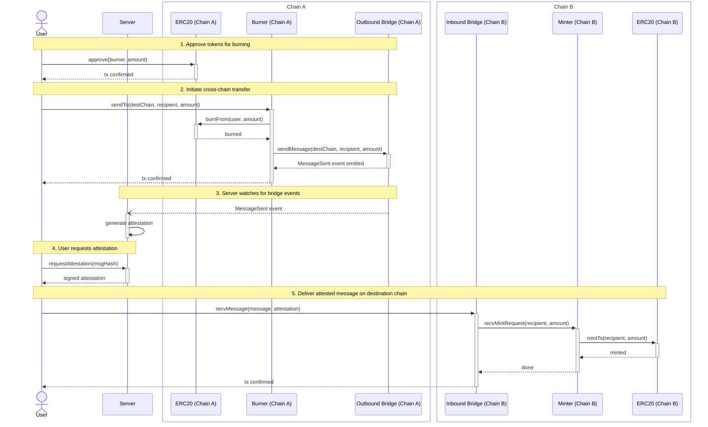

# Cross-Chain Bridge Flow

How tokens move from Chain A to Chain B through a burn-and-mint bridge with off-chain attestation.

## Step-by-step summary

| Step | Actor | Action | Chain |
|------|-------|--------|-------|
| 1 | User | `approve()` the Burner to spend tokens | A |
| 2 | User | `sendTo()` on Burner, which burns tokens and sends a bridge message | A |
| 3 | Server | Watches `MessageSent` events, produces attestations | off-chain |
| 4 | User | Fetches the signed attestation from the Server | off-chain |
| 5 | User | `recvMessage()` on Inbound Bridge, which mints tokens via Minter | B |
